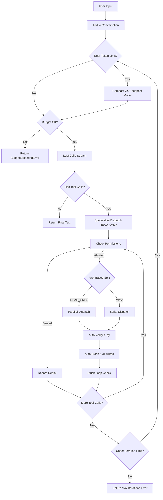
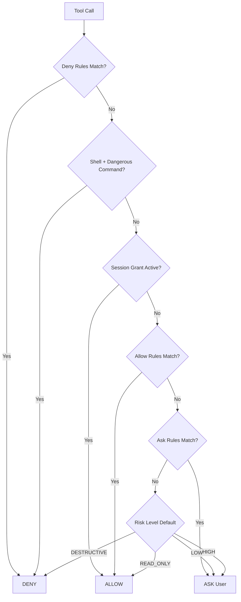
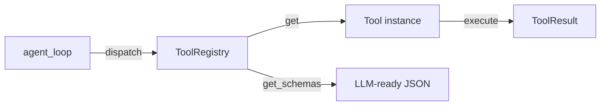

# Godspeed Architecture

> Security-first coding agent. Hand-rolled ReAct loop. No framework overhead.
> 2,000+ tests passing

---

<!-- PART 1: Core Loop -->

## Part 1: Core Loop

**Files**: `agent/loop.py`, `agent/conversation.py`, `agent/events.py`

### ReAct Cycle

The agent loop (`async agent_loop()`) follows the pattern proven by mini-swe-agent (74%+ SWE-bench), extended with parallel tool execution, speculative dispatch, and cost budget enforcement:

```
User input → Conversation → LLM call → Tool calls? → Parallel/Serial Split → Execute → Loop
                                      → Text only?  → Return (done)
```



### Constants

| Constant | Value | Purpose |
|----------|-------|---------|
| `MAX_ITERATIONS` | 50 | Per `agent_loop()` invocation |
| `MAX_RETRIES` | 3 | Malformed tool call tolerance |
| `STUCK_LOOP_THRESHOLD` | 3 | Identical errors before intervention |
| `AUTO_STASH_THRESHOLD` | 3 | Consecutive writes before git stash |

### Callback Types

All optional parameters to `agent_loop()`:

| Type | Signature | When |
|------|-----------|------|
| `OnAssistantText` | `(str) → None` | Final complete text (non-streaming only) |
| `OnToolCall` | `(str, dict) → None` | Before tool execution |
| `OnToolResult` | `(str, ToolResult) → None` | After tool execution |
| `OnPermissionDenied` | `(str, str) → None` | Permission engine blocks a call |
| `OnChunk` | `(str) → None` | Each streaming text delta |
| `OnThinking` | `(str) → None` | Extended thinking block from Claude |

**Streaming vs Batch**: When `on_assistant_chunk` is provided, uses `llm_client.stream_chat()` (async generator). Otherwise uses `llm_client.chat()` (batch). The `on_assistant_text` callback is skipped when streaming was used (prevents double-render).

### Speculative Tool Dispatch

During LLM streaming, tool calls are parsed incrementally. When a complete READ_ONLY tool call is detected before generation finishes, it is dispatched immediately as a background `asyncio.Task`. When the full response arrives, cached results are used instead of re-executing. This significantly reduces latency for read-heavy workflows.

### Parallel / Serial Tool Dispatch

When the LLM returns multiple tool calls in a single response:
- **READ_ONLY** tools (file_read, glob_search, grep_search, repo_map, verify) are dispatched in parallel via `asyncio.gather()`
- **Write** tools (file_edit, file_write, shell, git) are dispatched sequentially to prevent race conditions
- Results are ordered: read results first, then write results

### Pause/Resume

Optional `pause_event: asyncio.Event` parameter. When cleared, the loop waits at the top of each iteration via `await pause_event.wait()`. Set the event to resume. Used by `/pause`, `/resume`, and `/guidance` commands for human-in-the-loop control.

### Stuck-Loop Detection

Tracks recent error hashes (SHA-256). When `STUCK_LOOP_THRESHOLD` identical consecutive errors occur, injects a user message: *"You have failed 3 times with the same error. Stop, explain what is wrong, and try a completely different approach."* Resets on any non-error result.

### Auto-Verify

After successful `file_edit` or `file_write` on `.py`/`.pyi` files, automatically dispatches the `verify` tool. Results feed back into conversation for self-correction. Silently skipped if verify tool not registered.

### Auto-Stash

Tracks consecutive write operations. After `AUTO_STASH_THRESHOLD` consecutive writes, calls `git stash` once per loop invocation. Injects a tool result explaining the stash. Resets counter on any non-write tool.

### Conversation Management

`Conversation` wraps message history with token-aware compaction:

- **`add_user_message(content)`** / **`add_assistant_message(content, tool_calls)`** / **`add_tool_result(tool_call_id, content)`** — standard message append
- **`compact(summary)`** — replaces history with summary, logs token reduction
- **`is_near_limit`** — `token_count >= max_tokens * compaction_threshold` (default 0.8)
- **`messages`** property — returns `[system_message, *history]`

Token counting via `count_message_tokens(messages, model)` from the tokenizer module.

---

<!-- PART 2: Security Model -->

## Part 2: Security Model

**Files**: `security/permissions.py`, `security/dangerous.py`, `security/secrets.py`

### Permission Evaluation Order

Deny-first, 6-step evaluation:



### Risk Levels

```python
class RiskLevel(StrEnum):
    READ_ONLY = "read_only"   # Auto-allow, no prompt
    LOW = "low"               # Ask once, then session-allow
    HIGH = "high"             # Ask every time (default)
    DESTRUCTIVE = "destructive"  # Deny by default
```

### Permission Engine

```python
class PermissionEngine:
    def evaluate(tool_call) -> PermissionDecision  # 6-step chain
    def grant_session_permission(pattern)           # TTL=3600s, fnmatch
    def revoke_session_permission(pattern)
    def revoke_session_permissions()                # Clear all
```

`PermissionDecision` supports string comparison: `decision == "allow"`. Has `.action` and `.reason` fields.

**Plan Mode**: When `permission_engine.plan_mode = True`, all non-`READ_ONLY` tools are blocked. Toggled by `/plan` command.

**Session Grants**: Pattern-based (fnmatch), TTL of 3600 seconds (1 hour). Thread-safe with `threading.Lock`. Expired grants cleaned on next check.

### Dangerous Command Detection

50+ compiled regex patterns in `dangerous.py`. Categories:

| Category | Examples |
|----------|----------|
| Filesystem | `rm -rf /`, `chmod 777`, `mkfs.` |
| Disk | `dd if=`, raw writes to `/dev/sd*` |
| Pipe-to-shell | `curl \| sh`, `wget \| python` |
| SQL | `DROP TABLE`, `DELETE FROM`, `TRUNCATE` |
| Git | `git push --force`, `git reset --hard` |
| System | `kill -9`, `systemctl stop`, `eval(` |
| Privilege | `sudo`, `su -` |
| Reverse shell | `nc -l`, `ncat` |
| Supply chain | `npm publish`, `pip install --force-reinstall`, `twine upload` |
| Container | `docker run --privileged`, `docker system prune` |
| Kubernetes | `kubectl delete` |

**Function**: `detect_dangerous_command(command: str) -> list[str]` — returns matched danger descriptions. Empty list = safe.

### Secret Detection & Redaction

4-layer protection:

1. **File access deny rules** — permission engine blocks reads of `.env`, credential files
2. **Context cleaning** — redact secrets before LLM sees content
3. **Output filtering** — scan LLM responses for leaked secrets
4. **Audit log redaction** — secrets never written to audit trail

30+ secret patterns: API keys (Claude, OpenAI, AWS, GitHub, GitLab, Slack, Stripe, HuggingFace, etc.), private keys (RSA, OpenSSH, PKCS8), database connection strings (PostgreSQL, MySQL, MongoDB), Bearer/JWT tokens, environment variable assignments (`password=`, `api_key=`, etc.).

**High-entropy detection**: Shannon entropy ≥ 4.5 bits/char on strings ≥ 20 chars.

```python
class SecretFinding:
    secret_type: str   # e.g. "openai_api_key"
    match: str         # the matched text
    start: int         # byte offset
    end: int           # byte offset

detect_secrets(text) -> list[SecretFinding]
redact_secrets(text) -> str  # replaces with [REDACTED]
```

---

<!-- PART 3: Tool System -->

## Part 3: Tool System

**Files**: `tools/base.py`, `tools/registry.py`

### Tool ABC

Every tool implements this interface:

```python
class Tool(abc.ABC):
    @property
    def name(self) -> str              # Unique identifier
    @property
    def description(self) -> str       # For LLM system prompt
    @property
    def risk_level(self) -> RiskLevel  # READ_ONLY / LOW / HIGH / DESTRUCTIVE

    def get_schema(self) -> dict       # JSON Schema (OpenAI function-calling format)
    async def execute(self, arguments: dict, context: ToolContext) -> ToolResult
```

### Data Models

```python
class ToolCall(BaseModel):
    tool_name: str
    arguments: dict[str, Any] = {}
    call_id: str = ""
    def format_for_permission(self) -> str
        # Returns "ToolName(arg_summary)" for pattern matching
        # Priority: command > file_path > action > first_string_value

class ToolResult(BaseModel):
    output: str = ""
    error: str | None = None
    is_error: bool = False
    @classmethod ok(output) -> ToolResult       # Success factory
    @classmethod failure(error) -> ToolResult   # Error factory

class ToolContext(BaseModel):
    cwd: Path
    session_id: str
    permissions: PermissionEvaluator | None = None
    audit: AuditRecorder | None = None
```

### Tool Registry



```python
class ToolRegistry:
    register(tool)              # Add tool, ValueError on duplicate
    get(name) -> Tool | None
    has_tool(name) -> bool
    list_tools() -> list[Tool]
    get_schemas() -> list[dict]  # [{"type": "function", "function": {...}}]
    async dispatch(tool_call, context) -> ToolResult
```

### Built-In Tools (18+)

**Core Tools (always registered):**

| Tool | Risk Level | Purpose |
|------|-----------|---------|
| `file_read` | READ_ONLY | Read file content with line numbers |
| `file_write` | LOW | Create or overwrite file |
| `file_edit` | LOW | Search/replace in existing file |
| `shell` | HIGH | Run bash commands (cwd-sandboxed, supports `background` mode) |
| `git` | HIGH | Git operations (status, commit, diff, stash, etc.) |
| `glob_search` | READ_ONLY | Find files by glob pattern |
| `grep_search` | READ_ONLY | Search file content with regex |
| `repo_map` | READ_ONLY | Tree-sitter symbol extraction |
| `verify` | READ_ONLY | Run linter checks (ruff for Python, with lint-fix retry) |
| `test_runner` | HIGH | Run pytest/npm test with output capture |
| `web_search` | READ_ONLY | Search the web via DuckDuckGo |
| `web_fetch` | READ_ONLY | Fetch URL content as markdown |
| `notebook_edit` | LOW | Cell-level Jupyter notebook operations |
| `background_check` | LOW | Poll/read/kill background shell processes |
| `task` | LOW | Create and manage task lists |
| `spawn_agent` | HIGH | Delegate work to sub-agents |

**Optional Tools (registered when dependencies available):**

| Tool | Risk Level | Extra | Purpose |
|------|-----------|-------|---------|
| `image_read` | READ_ONLY | `[image]` | Read PNG/JPG/GIF/WebP as base64 for vision LLMs |
| `pdf_read` | READ_ONLY | `[pdf]` | Extract text from PDF with page ranges |
| `github` | HIGH | (requires `gh` CLI) | Create PRs, read issues, comment |
| `diff_apply` | LOW | — | Apply unified diff patches to files |
| `code_search` | READ_ONLY | `[search]` | Semantic code search via embeddings |

Plus any MCP tools (HIGH) dynamically registered from configured MCP servers.

---

<!-- PART 4: Intelligence -->

## Part 4: Intelligence

**Files**: `agent/system_prompt.py`, `context/compaction.py`, `llm/client.py`, `llm/cost.py`, `context/checkpoint.py`, `context/repo_map.py`, `tools/verify.py`

### System Prompt Assembly

`build_system_prompt()` constructs the full prompt from 5 layers:

1. **Core prompt** — role, security mindset, tool usage guidelines
2. **Plan mode prompt** — restricts to read-only tools (if active)
3. **Working directory** — `cwd` for file path context
4. **Project instructions** — from `GODSPEED.md` in project root
5. **Tool descriptions** — name, description, risk_level for each registered tool

### Model-Aware Compaction

Three tiers based on context window size:

| Tier | Context Window | Strategy |
|------|---------------|----------|
| Small | ≤ 32K tokens | Aggressive — keep only current task, file paths, last error. Target < 500 words |
| Medium | 32K – 100K | Balanced — keep architecture decisions, modified paths, unresolved issues, last 3 tool results |
| Large | > 100K | Detailed — preserve rationale, code patterns, all modified paths, summarized tool results |

**Thresholds**: `SMALL_CONTEXT_THRESHOLD = 32,768`, `LARGE_CONTEXT_THRESHOLD = 100,000`

Compaction triggers when `conversation.is_near_limit` (80% of max tokens). A separate LLM call summarizes history, then `conversation.compact(summary)` replaces old messages.

### LLM Client & Model Routing

```python
class LLMClient:
    model: str                          # Primary model
    fallback_models: list[str]          # Fallback chain
    router: ModelRouter | None          # Task-type routing
    thinking_budget: int                # Extended thinking token budget (0 = disabled)
    max_cost_usd: float                 # Hard cost limit (0.0 = unlimited)
    total_input_tokens: int             # Running total
    total_output_tokens: int
    total_cost_usd: float               # Running cost estimate

    async chat(messages, tools, task_type) -> ChatResponse
    async stream_chat(messages, tools) -> AsyncGenerator[ChatResponse]
```

**Backend**: LiteLLM (200+ providers — Claude, GPT, Gemini, Ollama, etc.)

**Model Routing**: `ModelRouter` maps task types (plan, edit, chat) to specific models. Falls back to default model for unmapped types.

**Fallback Chain**: On failure, retries primary after 1s sleep, then tries each fallback model in order. Skips retries entirely if connection error detected (server unreachable).

**Ollama Upgrade**: Models prefixed `ollama/` are upgraded to `ollama_chat/` for tool-capable chat completions.

**Prompt Caching**: For Anthropic models, system messages are wrapped in content blocks with `cache_control: {"type": "ephemeral"}` to reduce repeated input costs.

### Extended Thinking

For Claude models with `thinking_budget > 0`, passes `thinking={"type": "enabled", "budget_tokens": N}` to LiteLLM. The response includes `thinking` content blocks displayed in a collapsed dim panel before the main response. Toggled via `/think [budget]` command.

### Cost Estimation & Budget Enforcement

`llm/cost.py` provides model pricing and cost tracking:

```python
estimate_cost(model, input_tokens, output_tokens) -> float  # USD
format_cost(cost) -> str              # "$1.50" or "free"
get_cheapest_model(models) -> str     # Lowest $/token from a list
```

- Ollama models always return `$0.0` (local inference)
- Provider prefixes (`anthropic/`, `openai/`) are stripped for pricing lookup
- Unknown models default to free (conservative — avoids false budget blocks)

After each `chat()` call, `LLMClient` updates `total_cost_usd`. If `max_cost_usd > 0` and cost exceeds the limit, raises `BudgetExceededError(spent, limit)`. The agent loop catches this and returns an informative message.

### Cheapest-Model Compaction

When conversation compaction triggers, `_compact_conversation()` selects the cheapest model from `[main_model, *fallback_models]` via `get_cheapest_model()`. If only Ollama models are available (all free), uses the main model. Falls back to main model on error.

### Checkpoint Save/Restore

```python
save_checkpoint(name, system_prompt, messages, model, token_count, project_dir) -> Path
load_checkpoint(name, project_dir) -> dict | None
list_checkpoints(project_dir) -> list[dict]  # name, timestamp, model, token_count
delete_checkpoint(name, project_dir) -> bool
```

**Storage**: JSON files at `.godspeed/checkpoints/{safe_name}.checkpoint.json`. Filename sanitized for filesystem safety.

### Repo Map (Tree-Sitter)

```python
class RepoMapper:
    parse_file(file_path) -> list[Symbol]
    map_directory(directory, max_depth=5, pattern="") -> str
```

`Symbol` dataclass: `name`, `kind` (function/class/method/type), `line` (1-based), `children`.

**Languages**: Python, JavaScript/TypeScript, Go via `tree_sitter_language_pack`.

**Graceful degradation**: Returns empty map if tree-sitter not installed. Agent can still use grep/glob.

### Verification Cascade

`VerifyTool` runs `ruff check --select=E,W,F` on Python files. Auto-triggered after `file_edit`/`file_write` on `.py`/`.pyi` files. Results feed back into conversation so the agent self-corrects lint errors in the next iteration.

---

<!-- PART 5: Autonomy -->

## Part 5: Autonomy

**Files**: `agent/coordinator.py`, `agent/architect.py`, `tools/spawn_agent.py`, `mcp/client.py`, `mcp/tool_adapter.py`

### Sub-Agent Architecture

```python
class AgentCoordinator:
    max_depth: int = 3          # MAX_SUB_AGENT_DEPTH
    iteration_limit: int = 25   # SUB_AGENT_ITERATION_LIMIT

    async spawn(task, depth=0) -> str
    async spawn_parallel(tasks, depth=0) -> list[str]
```

Each sub-agent gets:
- **Isolated** `Conversation` (own context window)
- **Shared** `ToolRegistry` and `ToolContext` (same tools, same permissions)
- **Reduced** iteration limit (25 vs 50 for main agent)

**Depth enforcement**: `MAX_SUB_AGENT_DEPTH = 3`. Main → Level 1 → Level 2 → Level 3 (stops). Deeper spawn attempts return an error.

### Parallel Spawn

```python
async spawn_parallel(tasks, depth=0) -> list[str]:
    return await asyncio.gather(*[spawn(t, depth) for t in tasks])
```

Results returned in order. No cancellation on individual failure — each sub-agent runs independently.

### SpawnAgentTool

Registered as a standard tool: `name="spawn_agent"`, `risk_level=HIGH`. The agent calls it like any other tool to delegate work. Arguments: `task` (string description), optionally `parallel_tasks` (list of strings).

### Architect Mode

Two-phase pipeline toggled via `/architect`:

1. **Plan phase** — Calls the architect model (configurable, defaults to main model with planning system prompt) with **read-only tools only**. Produces a detailed implementation plan.
2. **Execute phase** — Injects the plan as a user message, calls the main model with **full tool access** to implement the plan.

```python
async architect_loop(task, llm_client, tool_registry, ...) -> str
```

Controlled by `config.architect_model` (separate model for planning) and the `/architect` toggle command.

### MCP Client (Model Context Protocol)

```python
class MCPServerConfig:
    name: str
    command: str                     # e.g. "npx", "python"
    args: list[str] | None           # e.g. ["-m", "mcp_server"]
    env: dict[str, str] | None
    transport: str = "stdio"         # "stdio" or "sse"

class MCPClient:
    async connect(config) -> list[MCPToolDefinition]
    async call_tool(server_name, tool_name, arguments) -> str
    async disconnect_all()
```

**Transport**: Stdio (spawns subprocess, communicates via stdin/stdout JSON-RPC) or SSE (connects to HTTP server with Server-Sent Events).

**Graceful degradation**: Returns empty tool list if `mcp` package not installed.

### MCP Tool Adapter

Bridges MCP tools into Godspeed's tool system:

```python
class MCPToolAdapter(Tool):
    name = "mcp_{server_name}_{tool_name}"
    risk_level = RiskLevel.HIGH   # External server code — always HIGH
    async execute(arguments, context) -> ToolResult
```

`adapt_mcp_tools(definitions, mcp_client) -> list[MCPToolAdapter]` converts discovered MCP tools into registerable Godspeed tools.

### Human-in-the-Loop

Three TUI commands enable mid-session intervention:

| Command | Effect |
|---------|--------|
| `/pause` | Clears `pause_event` — loop waits at next iteration |
| `/resume` | Sets `pause_event` — loop continues |
| `/guidance <msg>` | Injects message into conversation, then resumes |

---

<!-- PART 6: Memory & TUI -->

## Part 6: Memory & TUI

**Files**: `memory/user_memory.py`, `memory/session.py`, `memory/corrections.py`, `tui/theme.py`, `tui/output.py`, `tui/commands.py`, `tui/completions.py`

### User Memory (Persistent)

SQLite database at `~/.godspeed/memory.db` with WAL mode for concurrent reads.

**Tables**:

```sql
CREATE TABLE preferences (
    key TEXT PRIMARY KEY,
    value TEXT NOT NULL,
    updated_at REAL NOT NULL
);

CREATE TABLE corrections (
    id INTEGER PRIMARY KEY AUTOINCREMENT,
    original TEXT NOT NULL,
    corrected TEXT NOT NULL,
    context TEXT NOT NULL DEFAULT '',
    created_at REAL NOT NULL
);
```

```python
class UserMemory:
    # Preferences (key/value store)
    get(key, default=None) -> str | None
    set(key, value) -> None
    delete(key) -> bool
    list_preferences() -> list[dict]

    # Corrections (learning from mistakes)
    record_correction(original, corrected, context="") -> int
    get_corrections(limit=10) -> list[dict]
    delete_correction(correction_id) -> bool
    correction_count() -> int
```

### Session Memory

Same SQLite database. Two additional tables:

```sql
CREATE TABLE sessions (
    id TEXT PRIMARY KEY,
    model TEXT NOT NULL,
    started_at REAL NOT NULL,
    ended_at REAL,
    project_dir TEXT NOT NULL DEFAULT '',
    summary TEXT NOT NULL DEFAULT ''
);

CREATE TABLE session_events (
    id INTEGER PRIMARY KEY AUTOINCREMENT,
    session_id TEXT REFERENCES sessions(id),
    event_type TEXT NOT NULL,
    detail TEXT NOT NULL DEFAULT '',
    created_at REAL NOT NULL
);
```

Event types: `session_start`, `session_end`, `tool_call`, `tool_error`, `user_correction`, `compaction`.

### Correction Tracking

Heuristic detection of user corrections via 11 negation patterns:

`no`, `don't`, `stop`, `not`, `instead`, `wrong`, `actually`, `please don't/stop/use`, `never`, `always`, `prefer`

`is_likely_correction(message)` returns True if message matches a pattern and is 2–100 words.

`CorrectionTracker`:
- `check_for_correction(user_message, last_agent_action)` — auto-detect & record, returns correction ID or None
- `format_for_system_prompt(n=5)` — formats top N corrections for system prompt injection

### Midnight Gold Theme

Single source of truth for all Rich/prompt-toolkit styling:

**Palette**:

| Constant | Value | Use |
|----------|-------|-----|
| `PRIMARY` | `gold1` | Brand color |
| `SECONDARY` | `steel_blue` | Panels, structure |
| `SUCCESS` | `green3` | Success states |
| `ERROR` | `indian_red1` | Errors |
| `WARNING` | `dark_orange` | Caution |
| `MUTED` | `grey58` | Secondary text |
| `ACCENT` | `cornflower_blue` | Interactive elements |

**Semantic styles**: `BOLD_PRIMARY`, `BOLD_ERROR`, `BOLD_SUCCESS`, `BOLD_WARNING`, `BORDER_BRAND`, `BORDER_TOOL`, `BORDER_SUCCESS`, `BORDER_ERROR`, `BORDER_WARNING`, `BORDER_INFO`, `TABLE_HEADER`, `TABLE_BORDER`, `TABLE_KEY`, `TABLE_VALUE`, `PERM_ALLOW`, `PERM_DENY`, `PERM_ASK`, `PERM_SESSION`, `CTX_OK`, `CTX_WARN`, `CTX_CRITICAL`, `DIM`, `SYNTAX_THEME` (monokai).

**Brand**: `PROMPT_ICON = "⚡"`, `PROMPT_TEXT = "godspeed"`, `BRAND_TAGLINE = "Security-first coding agent"`.

Helpers: `styled(text, style)` → Rich markup, `brand(version)` → branded string, `icon_prompt(state)` → prompt-toolkit HTML.

### Rich Output

`tui/output.py` provides all rendering functions:

| Function | Purpose |
|----------|---------|
| `format_welcome()` | Branded banner with model, tools, deny rules |
| `format_assistant_text()` | Rich Markdown rendering |
| `format_tool_call()` | Panel with tool name + JSON args |
| `format_tool_result()` | Panel with result (truncated >2000 chars) |
| `format_permission_prompt()` | Contextual preview (diff, code, path) |
| `format_permission_denied()` | Red denial notice |
| `format_stats()` | Token usage table |
| `format_error()` | Bold red error |

### Slash Commands (25)

| Command | Purpose |
|---------|---------|
| `/help` | Show all commands |
| `/model [name]` | Show or switch active model |
| `/clear` | Wipe conversation history |
| `/undo` | `git reset --soft HEAD~1` |
| `/audit` | Show audit stats, verify hash chain |
| `/permissions` | Table of DENY/ALLOW/ASK/SESSION rules |
| `/extend [N]` | Set max iterations (default 50) |
| `/context` | Token usage (count/max, percentage) |
| `/plan` | Toggle plan mode (read-only) |
| `/checkpoint [name]` | Save checkpoint or list all |
| `/restore <name>` | Load checkpoint, restore conversation |
| `/pause` | Pause agent at next iteration |
| `/resume` | Resume paused agent |
| `/guidance <msg>` | Inject guidance, resume agent |
| `/tasks` | Show current task list and status |
| `/reindex` | Rebuild code search index |
| `/stats` | Show session statistics (tokens, cost, tools) |
| `/autocommit` | Toggle auto-commit after file writes |
| `/architect` | Toggle architect mode (plan → execute pipeline) |
| `/think [budget]` | Toggle extended thinking, set token budget |
| `/budget [amount]` | Show/set cost budget limit |
| `/evolve [action]` | Self-evolution management (run/status/review/rollback) |
| `/export` | Export conversation as markdown |
| `/quit` | Exit with session stats |
| `/exit` | Alias for `/quit` |

### Tab Completions

`GodspeedCompleter` provides prompt-toolkit completions for:
- Slash commands (when input starts with `/`)
- File paths (when in argument position)

### TUI Application

`TUIApp` orchestrates the full interactive loop:

1. Show welcome banner
2. Create `PromptSession` (prompt-toolkit) with key bindings
3. Loop: read input → dispatch command or run `agent_loop()`
4. `_ThinkingSpinner`: Rich Status spinner shown before first LLM output, auto-clears via `wrap()` pattern
5. `_InteractivePermissionProxy`: wraps `PermissionEngine` to prompt user on ASK decisions

Key bindings: Enter (submit), Escape+Enter (newline), Ctrl+C (abort input).

---

## Audit Trail

**Files**: `audit/trail.py`, `audit/events.py`

Hash-chained audit log for tamper detection:

- Every event gets SHA-256 hash of `previous_hash + event_data`
- Events: `session_start`, `session_end`, `tool_call` (with latency), errors
- `/audit` command verifies chain integrity
- Secrets redacted before recording
- JSONL format consumed by the self-evolution trace analyzer for cross-session learning

---

<!-- PART 7: Self-Evolution -->

## Part 7: Self-Evolution System

**Files**: `evolution/trace_analyzer.py`, `evolution/mutator.py`, `evolution/fitness.py`, `evolution/safety.py`, `evolution/registry.py`, `evolution/applier.py`, `evolution/hardware.py`, `evolution/cross_session.py`, `evolution/skill_gen.py`, `evolution/permissions.py`

Inspired by [NousResearch/hermes-agent-self-evolution](https://github.com/NousResearch/hermes-agent-self-evolution). Runs the entire evolution loop locally via Ollama for **$0**. Optional paid API acceleration.

### Pipeline

```
Audit Trail (JSONL) → Trace Analyzer → Evolution Engine (GEPA mutations)
    → Fitness Evaluator (LLM-as-judge) → Safety Gate → Registry → Hot-Swap
```

### Trace Analyzer

Parses audit trail JSONL into actionable insights:
- **Tool failure patterns** — grouped by tool + error category, ranked by frequency
- **Tool latency stats** — p50/p95/p99 per tool
- **Permission patterns** — tools repeatedly denied → suggest allowlist
- **Multi-tool sequences** — repeated tool chains → candidates for skill auto-generation

Streaming line-by-line reads (not `readlines()`) for low-memory devices like Jetson Orin.

### Evolution Engine (GEPA Mutations)

Generates improved candidates for tool descriptions, system prompt sections, and compaction prompts using LLM-guided mutations. Produces 1–5 candidates per mutation based on available VRAM.

### Fitness Evaluator

Scores candidates via A/B testing with LLM-as-judge:
- **Correctness** (weight 0.5) — did the tool/prompt produce correct results?
- **Procedure following** (weight 0.3) — did it follow the right steps?
- **Conciseness** (weight 0.2) — was output appropriately sized?
- Length penalty if mutated text exceeds 2× original

### Safety Gate

All mutations must pass before applying:
1. 100% test suite pass with mutation in place
2. Size limit — mutated text ≤ 2× original length
3. Semantic drift — word overlap stays above threshold
4. Minimum fitness score ≥ 0.6
5. Human review required for system prompt core sections and HIGH-risk tool descriptions

### Evolution Registry

Append-only JSONL at `~/.godspeed/evolution/registry.jsonl`. Full mutation history with rollback support.

### Hardware-Aware Model Selection

Auto-detects available VRAM and selects the best Ollama model for evolution:

| VRAM | Model | Candidates | Eval Cases |
|------|-------|-----------|------------|
| ≥ 10 GB | `ollama/gemma3:12b` | 5 | 5 |
| ≥ 6 GB | `ollama/gemma3:4b` | 3 | 3 |
| ≥ 3 GB | `ollama/qwen2.5:3b` | 2 | 2 |
| < 3 GB | `ollama/qwen2.5:1.5b` | 1 | 1 |

Detection: `nvidia-smi` for discrete GPUs, `/proc/meminfo` for Jetson (60% shared RAM factor). API models (Claude, GPT) bypass detection entirely.

### Additional Modules

- **Cross-Session Learning** — aggregates insights across sessions, detects regressions, produces model-specific description tuning
- **Skill Auto-Generation** — detects repeated multi-tool patterns (≥3 occurrences), generates skill markdown with YAML frontmatter
- **Permission Advisor** — analyzes denial/approval patterns, suggests allowlist optimizations

---

## Configuration

**File**: `config.py`

Pydantic-settings with YAML merge (3 layers):

1. **Global**: `~/.godspeed/settings.yaml`
2. **Project**: `.godspeed/settings.yaml`
3. **Environment**: `GODSPEED_*` env vars

```yaml
model: "ollama_chat/qwen3:8b"
fallback_models: ["ollama_chat/gemma3:4b"]
permissions:
  deny: ["rm -rf *", "sudo *"]
  allow: ["file_read(*)", "glob_search(*)"]
  ask: ["shell(*)"]
mcp_servers:
  - name: filesystem
    command: npx
    args: ["-y", "@anthropic/mcp-server-filesystem"]
    transport: stdio  # or "sse"
model_routing:
  plan: "claude-sonnet-4-20250514"
  edit: "ollama_chat/qwen3:8b"
  chat: "ollama_chat/gemma3:4b"

# Extended thinking (Claude models)
thinking_budget: 0            # 0 = disabled, N = token budget

# Cost management
max_cost_usd: 0.0            # 0.0 = unlimited

# Architect mode
architect_model: ""           # Separate model for planning phase

# Self-evolution
evolution_enabled: false
evolution_model: ""           # Auto-detected from VRAM if empty
```

---

## CLI Entry Points

**File**: `cli.py`

Click-based CLI with subcommands:

| Command | Purpose |
|---------|---------|
| `godspeed` | Launch interactive TUI |
| `godspeed init` | Create `~/.godspeed/` + default settings |
| `godspeed version` | Print version |
| `godspeed models` | List available models (cost/context/free) |
| `godspeed audit verify` | Verify audit chain integrity |
| `godspeed export-training` | Export conversation logs to fine-tuning JSONL |

`_run_app()` wires everything: settings → LLM client → tools → permissions → audit → conversation logger → conversation → TUIApp.

---

## Part 8: Training Data Pipeline

**Files**: `training/conversation_logger.py`, `training/exporter.py`, `training/rewards.py`, `training/benchmark.py`

### Why This Exists

The audit trail captures tool metadata (name, arguments, latency, outcome) but **not** the actual conversation: user requests, assistant reasoning, full tool results, and compaction summaries are all lost when a session ends. This module closes that gap, enabling fine-tuning of tool-calling LLMs on real Godspeed sessions.

Research backing: FireAct (500-1000 expert traces for 80% capability), AgentQ (GRPO adds 10-15% over SFT), AgentTuning (5-10% agent data mixing prevents catastrophic forgetting).

### ConversationLogger

Append-only JSONL writer hooked into `Conversation.add_user_message()`, `add_assistant_message()`, `add_tool_result()`, and `compact()`. One file per session at `~/.godspeed/training/{session_id}.conversation.jsonl`.

```
{"role":"system","content":"You are Godspeed...","timestamp":"...","session_id":"..."}
{"role":"user","content":"Fix the bug in auth.py","timestamp":"...","session_id":"..."}
{"role":"assistant","content":"","tool_calls":[{"id":"call_1","name":"grep_search","arguments":{"pattern":"auth"}}],...}
{"role":"tool","tool_call_id":"call_1","name":"grep_search","content":"auth.py:15: def authenticate(...)","is_error":false,"step":1,...}
{"role":"meta","event":"compaction","summary":"...","messages_before":45,"messages_after":8,...}
```

Gated on `GodspeedSettings.log_conversations` (default: `true`). Wired in both `_run_app()` (TUI) and `_headless_run()` (CI mode).

### TrainingExporter

Converts raw conversation JSONL into fine-tuning formats:

| Format | Target | Key Feature |
|--------|--------|-------------|
| `openai` | OpenAI fine-tuning API | `tool_calls` with `id` linking to `role: "tool"` responses, arguments as JSON strings |
| `chatml` | Qwen/Mistral native templates | `<\|im_start\|>` tokens, `<tool_call>` / `<tool_response>` blocks |
| `sharegpt` | Unsloth dataset loading | `conversations` array with `from`/`value` pairs |

**CLI**: `godspeed export-training --format openai --output training.jsonl`

Filtering options: `--min-tools`, `--min-turns`, `--success-only`, `--tools file_read,file_edit`, `--max-sessions`, `--max-tool-output`.

### Per-Step Reward Annotations

Automatic reward signals for GRPO/DPO fine-tuning:

| Signal | Value | When |
|--------|-------|------|
| Successful execution | +1.0 | `result.is_error == False` |
| Failed execution | -0.5 | `result.is_error == True` |
| Permission denied | -0.5 | Tool blocked by permission engine |
| Verify passed first try | +0.5 | Auto-verify succeeds after file_edit |
| Verify failed → retry fixed | +0.25 | Second verify passes (self-correction) |
| Dangerous command attempted | -1.0 | Shell command flagged by `detect_dangerous_command()` |
| Efficient tool sequence | +0.5 | grep → read → edit (canonical pattern) detected |

`annotate_session_rewards(messages)` interleaves `role: "reward"` entries into message lists. `summarize_rewards()` computes aggregate statistics.

### Benchmark Suite

20 hand-crafted tasks across easy/medium/hard difficulty, stored in `benchmarks/tasks.jsonl`:

```jsonl
{"task_id":"easy-fix-syntax-01","prompt":"There's a syntax error in app.py line 15","expected_tools":["file_read","file_edit"],"difficulty":"easy"}
{"task_id":"medium-find-fix-01","prompt":"Find where the database connection string is hardcoded and move it to an env var","expected_tools":["grep_search","file_read","file_edit"],"difficulty":"medium"}
{"task_id":"hard-multi-file-01","prompt":"Add error handling to all API endpoints in the routes/ directory","expected_tools":["glob_search","grep_search","file_read","file_edit"],"difficulty":"hard"}
```

**Scoring**:
- **Tool selection** (0-1): Jaccard similarity between expected and actual tool sets
- **Sequence quality** (0-1): Longest common subsequence / expected sequence length
- **Overall**: 0.6 × tool_selection + 0.4 × sequence_quality
