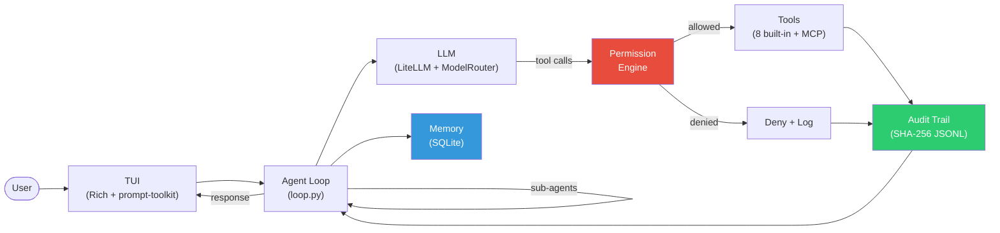

<div align="center">

# Godspeed

**Security-first open-source coding agent.**

[](https://github.com/omnipotence-eth/godspeed-coding-agent/actions/workflows/ci.yml)
[](https://www.python.org/downloads/)
[](https://github.com/BerriAI/litellm)
[](https://github.com/astral-sh/ruff)
[](LICENSE)

An AI coding agent that treats security as a first-class concern -- not an afterthought.

[Getting Started](#getting-started) | [Features](#features) | [Architecture](#architecture) | [Configuration](#configuration) | [Contributing](CONTRIBUTING.md)

</div>

---

## Why

Every open-source coding agent gives an LLM the ability to read files, write code, and run shell commands. None of them ship with a deny-first permission engine, a tamper-evident audit trail, or multi-layer secret protection out of the box. You are expected to bolt security on yourself, or trust the model not to `rm -rf /`.

Godspeed closes that gap. It pairs full coding capability (8 tools, 200+ LLM providers, sub-agents, MCP) with a security model that fails closed by default. Every tool call passes through a 4-tier permission engine. Every action is recorded in a hash-chained audit log you can cryptographically verify. Secrets are caught at four separate layers before they ever reach the model or the log file.

If you want a coding agent you can actually point at a production codebase, this is it.

## Features

### Security

- **4-tier permission engine** -- deny-first evaluation with pattern matching, dangerous command detection (72+ patterns), and fail-closed defaults. No tool call executes without explicit permission.
- **Hash-chained audit trail** -- SHA-256 JSONL log where each entry chains to the previous. Tamper-evident, compressible, and verifiable with `godspeed audit verify`.
- **Secret protection** -- 4 layers of defense: file deny-listing, context cleaning, output filtering, and audit redaction. 27 regex patterns plus Shannon entropy analysis catch API keys, tokens, and credentials before they leak.
- **Plan mode** -- `/plan` toggles read-only mode where only READ_ONLY tools are allowed, letting you explore safely before committing to changes.
- **Rich permission prompts** -- contextual detail in permission dialogs: file edits show mini-diffs, shell commands are syntax-highlighted, file writes show previews.

### Capability

- **200+ LLM providers** -- Claude, GPT, Gemini, Ollama, and everything else LiteLLM supports. Configure fallback chains so work never stops.
- **8 built-in tools** -- `file_read`, `file_write`, `file_edit` (with fuzzy matching + confidence reporting), `shell`, `glob`, `grep`, `git`, and `verify`. Everything a coding agent needs, nothing it doesn't.
- **Sub-agent coordinator** -- spawn isolated sub-agents for parallel tasks, each with their own conversation context. Depth limit 3, reuses the same async agent loop.
- **MCP client** -- connect to Model Context Protocol servers via stdio transport. Remote tools are auto-adapted to Godspeed's Tool ABC with HIGH risk level.
- **Model routing** -- route LLM calls by task type (plan/edit/chat) to different models. Use a cheap model for edits and a frontier model for planning.
- **Human-in-the-loop** -- `/pause` stops the agent at the next iteration, `/guidance <msg>` injects mid-conversation correction and resumes.
- **Conversation compaction** -- model-aware summarization when approaching the token limit. Small models get aggressive compaction, frontier models get detailed preservation.
- **Checkpoint save/restore** -- `/checkpoint name` saves conversation state, `/restore name` loads it back. Never lose context again.
- **Memory** -- SQLite-backed persistent preferences, session event logging, and automatic correction tracking across sessions.
- **GODSPEED.md project instructions** -- drop a `GODSPEED.md` in any project root to give the agent persistent context about your codebase, conventions, and constraints.
- **Rich TUI** -- syntax highlighting, diff rendering, streaming output, and slash commands via Rich and prompt-toolkit.

## Architecture



**How it works:**

The agent loop is hand-rolled (no framework) following the same pattern proven by top-performing coding agents. The LLM decides when to stop. On each turn, the LLM either responds with text (done) or requests tool calls. Every tool call passes through the **permission engine** before execution: deny rules are evaluated first and always win, then dangerous command detection (72+ regex patterns) blocks destructive operations, then session grants and allow rules, and finally the tool's risk level determines the default. If anything is ambiguous, it fails closed. After execution, the tool call, its result, and the permission decision are recorded in the **audit trail** -- a hash-chained JSONL file where each record includes the SHA-256 hash of the previous record. Secrets are redacted at four layers: file access deny rules, context cleaning before the LLM sees content, output filtering on LLM responses, and audit log redaction. The loop also includes **stuck-loop detection** (3 identical errors triggers a replan), **auto-verification** (ruff check after Python file edits), **auto-stash** (git stash after 3+ consecutive writes), and **pause/resume** for human-in-the-loop intervention.

**Key modules:**

| Module | Path | Purpose |
|--------|------|---------|
| Agent loop | `src/godspeed/agent/` | Conversation management, LLM interaction, tool dispatch, sub-agent coordinator |
| Security | `src/godspeed/security/` | Permission engine, dangerous command detection, secret scanning |
| Audit | `src/godspeed/audit/` | Hash-chained event logging, redaction, verification, compression |
| Tools | `src/godspeed/tools/` | 8 built-in tools with Pydantic schemas |
| LLM | `src/godspeed/llm/` | LiteLLM client wrapper, model routing, token counting |
| Context | `src/godspeed/context/` | Project instructions, compaction, checkpoints, repo map |
| MCP | `src/godspeed/mcp/` | Model Context Protocol client and tool adapter |
| Memory | `src/godspeed/memory/` | SQLite-backed preferences, session events, correction tracking |
| TUI | `src/godspeed/tui/` | Terminal UI, rich output, permission prompts, slash commands |

## Getting Started

### Install

```bash
pip install godspeed
```

Or with [uv](https://github.com/astral-sh/uv):

```bash
uv tool install godspeed     # installs globally — run 'godspeed' from anywhere
```

### Setup

```bash
# One-time setup — creates ~/.godspeed/ and default settings
godspeed init

# Pull a free local model (default, no API key needed)
ollama pull qwen3:4b
```

### Run

```bash
# Launch in any project directory — uses free local model by default
cd your-project/
godspeed
```

Or use a paid cloud model:

```bash
export ANTHROPIC_API_KEY="sk-..."
godspeed -m claude-sonnet-4-20250514
```

Switch models at any time with `/model <name>` inside the TUI, or run `godspeed models` to see all options.

Godspeed auto-upgrades `ollama/` to `ollama_chat/` for tool-capable models (Qwen, Llama, Gemma, Mistral, etc.).

Godspeed reads `GODSPEED.md` from the project root for persistent instructions -- similar to how other agents use `CLAUDE.md`.

### First session

```
$ godspeed
godspeed> Explain the authentication flow in this codebase
```

The agent will read your code, answer questions, write files, and run commands -- all gated by the permission engine.

### Slash commands

| Command | Description |
|---------|-------------|
| `/help` | Show available commands |
| `/model [name]` | Show or switch the active model |
| `/clear` | Clear conversation history |
| `/undo` | Undo last git commit (`git reset --soft HEAD~1`) |
| `/audit` | Show audit trail stats and verify chain integrity |
| `/permissions` | Show current permission rules and session grants |
| `/extend [N]` | Set max iterations per turn (default: 50) |
| `/context` | Show context window usage (tokens, percentage) |
| `/plan` | Toggle plan mode (read-only, explore and plan only) |
| `/checkpoint [name]` | Save conversation checkpoint, or list if no name |
| `/restore <name>` | Restore a saved checkpoint |
| `/pause` | Pause the agent loop at next iteration |
| `/resume` | Resume a paused agent loop |
| `/guidance <msg>` | Inject guidance and resume paused agent |
| `/quit` | Exit Godspeed |

## Configuration

### Project-level: `GODSPEED.md`

Drop a `GODSPEED.md` in your project root. The agent loads it as system context on every session. Use it for coding standards, architecture notes, or constraints. See [`GODSPEED.md.example`](GODSPEED.md.example) for a template.

### Global: `~/.godspeed/settings.yaml`

```yaml
model: claude-sonnet-4-20250514
fallback_models:
  - gpt-4o
  - gemini-2.0-flash

# Route different task types to different models
routing:
  plan: claude-sonnet-4-20250514
  edit: ollama/qwen3:4b
  chat: claude-sonnet-4-20250514

permissions:
  deny:
    - "FileRead(.env)"
    - "FileRead(*.pem)"
    - "FileRead(.ssh/*)"
  allow:
    - "Bash(git *)"
    - "Bash(ruff *)"
    - "Bash(pytest *)"
  ask:
    - "Bash(*)"

audit:
  enabled: true
  retention_days: 30

memory_enabled: true

# MCP servers (optional)
mcp_servers:
  - name: github
    command: npx
    args: ["-y", "@modelcontextprotocol/server-github"]
```

Permission rules use glob-style matching against `ToolName(argument)` strings. Deny rules are additive across config levels -- a project config cannot weaken global denies.

### Environment variables

| Variable | Purpose |
|----------|---------|
| `ANTHROPIC_API_KEY` | Claude access |
| `OPENAI_API_KEY` | GPT access |
| `GEMINI_API_KEY` | Gemini access |
| `GODSPEED_MODEL` | Override default model |

## How Godspeed Compares

| Feature | Godspeed | Claude Code | Cursor | Aider | OpenClaw |
|---------|----------|-------------|--------|-------|----------|
| Deny-first permission engine | **Yes** (4-tier, 72+ dangerous patterns) | Proprietary | No | No | No |
| Hash-chained audit trail | **Yes** (SHA-256 JSONL, verifiable) | No | No | No | No |
| Secret protection | **4 layers** (deny, context clean, output filter, audit redact) | Limited | No | No | No |
| Sub-agents | **Yes** (isolated, parallel, depth 3) | Yes | No | No | No |
| MCP support | **Yes** (stdio transport) | Yes | No | No | No |
| Model routing | **Yes** (per-task-type) | No | No | No | No |
| Human-in-the-loop | **Yes** (pause/resume/guidance) | Yes | No | No | No |
| Memory | **Yes** (SQLite, corrections) | Yes | No | No | No |
| Free by default | **Yes** (Ollama, zero API cost) | No (paid API) | No (subscription) | Yes | Yes |
| 200+ LLM providers | **Yes** (LiteLLM) | Claude only | OpenAI/Claude | ~15 | Limited |
| Open source | **MIT** | No | No | Apache 2.0 | MIT |

Godspeed is the only open-source coding agent that ships with production security primitives out of the box. Others expect you to bolt security on yourself or trust the model not to run destructive commands.

## Development

```bash
# Clone and install
git clone https://github.com/omnipotence-eth/godspeed-coding-agent.git
cd godspeed
uv sync --all-extras

# Lint and format
ruff check . --fix && ruff format .

# Run tests
pytest --cov

# Verify audit trail integrity
godspeed audit verify
```

## License

[MIT](LICENSE)

---

<div align="center">

Built by [Tremayne Timms](https://github.com/omnipotence-eth)

</div>
