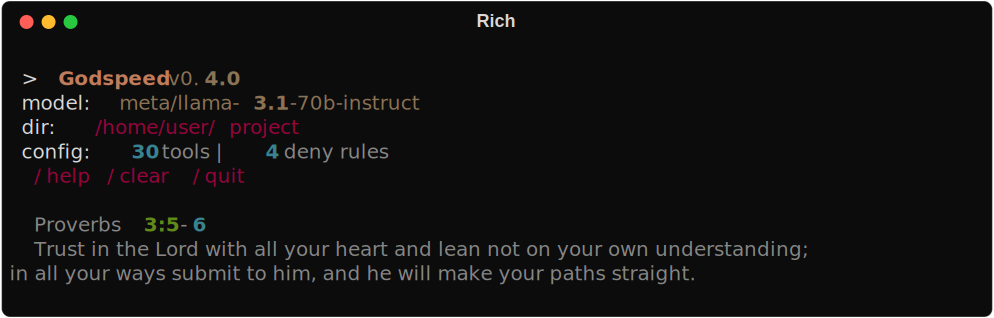
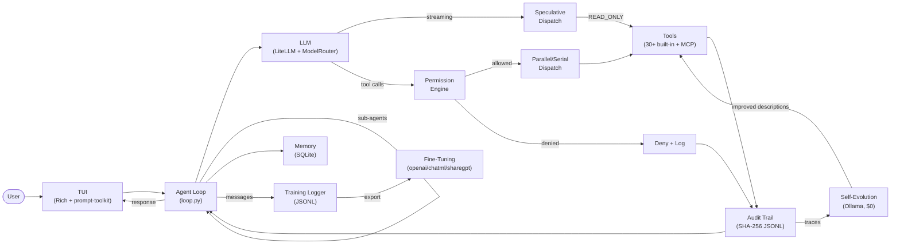
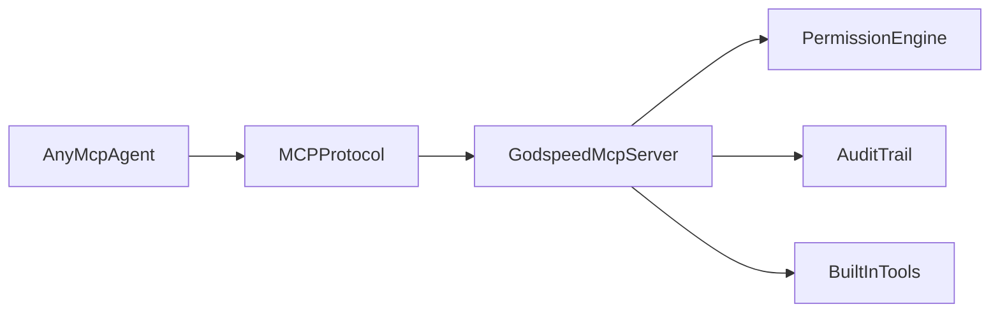

<div align="center">

# Godspeed

**Trusted open-source coding agent for production code.**

[](https://github.com/t-timms/godspeed-coding-agent/actions/workflows/ci.yml)
[](https://github.com/t-timms/godspeed-coding-agent/actions/workflows/codeql.yml)
[](https://www.python.org/downloads/)
[](https://github.com/BerriAI/litellm)
[](https://github.com/astral-sh/ruff)
[](LICENSE)
[](https://github.com/t-timms/godspeed-coding-agent/discussions)

> **Project Status: Alpha — Seeking Testers**
> 
> Godspeed is under active development by a solo maintainer. Breaking changes may occur between releases. We are looking for early adopters to test real-world workflows and report rough edges. See [ROADMAP.md](ROADMAP.md) for the path to v1.0 stable.

<picture>
  <source media="(prefers-color-scheme: dark)" srcset="docs/screenshots/tui-welcome.svg">
  
</picture>

A coding agent you can point at a production codebase and trust. Built-in permissions, audit trails, schema-validated tool calls, and automatic retries.

[Getting Started](#getting-started) | [Features](#features) | [Architecture](#architecture) | [Configuration](#configuration) | [Contributing](CONTRIBUTING.md) | [Discussions](https://github.com/t-timms/godspeed-coding-agent/discussions)

</div>

---

## What's new in v0.5.0

Skills system overhaul, retrieval sub-agent, and speculative decoding benchmarks.
Every change shipped with tests + CI-green across Python 3.11 / 3.12 / 3.13.

| Area | What changed | Why |
|---|---|---|
| **Skills overhaul** | Security scanning, evolution, dream consolidation, wiki bridge. | Four new modules for skill management: static analysis, lesson tracking, cross-session pruning, and knowledge-base integration. |
| **Retrieval sub-agent** | Read-only sub-agent for focused code exploration. | Delegates deep code searches without polluting main agent context. Structured `file:line-range` output. |
| **Speculative decoding** | GPU-accelerated draft model server + benchmark suite. | ~750 tok/s on RTX 5070 Ti with Qwen2.5-Coder-14B + 1.5B draft model. |
| **Model presets** | `fast`/`balanced`/`quality`/`local`/`cloud`/`frontier` shortcuts. | One-word model switching for different cost/quality tradeoffs. |
| **Default model** | Changed to `openai/qwen2.5-coder-14b` (llama.cpp). | Zero-cost local inference with GPU speculative decoding. |
| **Enhanced codebase index** | Better chunking, symbol extraction, freshness detection. | Semantic code search now finds relevant code faster. |

**Platform docs:** Windows users should read [`docs/quickstart_windows.md`](docs/quickstart_windows.md) for
platform-specific setup (Miniconda, `PYTHONIOENCODING`, WSL for SWE-bench).

## The Problem

Every AI agent that touches your codebase — Claude Code, Cursor, Hermes, your custom agent — can read files, write code, and run shell commands. Most do not ship with a cryptographically verifiable record of what they actually did. Most do not fail closed by default when a tool call is ambiguous. Most do not catch secrets before they reach the model.

You are expected to trust the model.

## What Godspeed Does

Godspeed is the secure execution layer for the MCP ecosystem. Run it as an MCP server and MCP-compatible agents can delegate file and shell operations through Godspeed's permission engine. Every action is logged in a hash-chained audit trail you can cryptographically verify. Secrets are filtered before they reach the model or the audit log.

Use it standalone as a CLI coding agent, or plug it into your existing agent stack as a security-focused execution layer.

## Features

### Trust & Reliability

- **Schema-validated tool calls** — every tool argument is validated against its JSON Schema before execution. Missing required fields, wrong types, and invalid values are caught with clear error messages — no silent failures.
- **Automatic retry on transient failures** — network timeouts, connection resets, and rate limits trigger automatic retries with exponential backoff. Logic errors and permission denials fail immediately.
- **3-tier permission modes** — user-facing operating modes: `strict` (deny most, ask for everything), `normal` (deny-first with allow rules), `yolo` (no permission checks, maximum speed). Configure via CLI (`--permission-mode`) or settings.yaml. These govern *when* the engine prompts you and *what* the default answer is.
- **4-tier permission engine** -- internal risk evaluation: each tool is assigned a risk level (READ_ONLY, LOW, MEDIUM, HIGH) that determines the default behavior when no explicit rule matches. Deny-first evaluation with pattern matching, dangerous command detection (100 patterns), and fail-closed defaults ensure no tool call executes without explicit permission in strict/normal mode. The 4-tier design is the *engine's internal classification*; the 3-tier modes are the *user-facing policy*.
- **Hash-chained audit trail** -- SHA-256 JSONL log where each entry chains to the previous. Tamper-evident, compressible, and verifiable with `godspeed audit verify`. Writes fail closed: any I/O error raises `AuditWriteError` and the chain state does not advance.
- **Secret protection** -- 4 layers of defense: file deny-listing, context cleaning, output filtering, and audit redaction. Regex patterns plus Shannon entropy analysis catch API keys, tokens, and credentials before they leak.
- **Post-edit syntax gate** -- `.py` / `.pyi` / `.json` edits that break parse are rejected before write. Lint-fix retry loop up to 3 rounds auto-corrects common issues.
- **Diff approve-before-write** -- `file_edit` / `file_write` / `diff_apply` prompt with a side-by-side diff before hitting disk. `(y)es · (n)o · (a)lways` keys. Two independent axes of consent: permission engine ("may this tool run?") + diff reviewer ("apply THIS specific diff?").

### Capability

- **200+ LLM providers via LiteLLM** — Claude, GPT, Gemini, Ollama, and everything else LiteLLM supports. Godspeed wraps LiteLLM's unified interface with fallback chains, model routing, cost tracking, and retry logic. Configure fallback chains so work never stops. ([LiteLLM attribution](#inspiration--attribution))
- **30+ built-in tools** — Core (29): `file_read` (images, PDFs, notebooks), `file_write`, `file_edit` (fuzzy matching), `notebook_edit`, `file_move`, `image_read`, `pdf_read`, `shell` (foreground + background), `glob`, `grep`, `git`, `github` (PR/issue via `gh`), `diff_apply` (unified diffs), `verify` (6 languages), `test_runner` (5 frameworks), `web_search`, `web_fetch`, `repo_map`, `code_search`, `tasks`, `background_check`, `coverage`, `complexity`, `dep_audit`, `security_scan`, `generate_tests`, `traceback_analyzer`, `system_optimizer`, `db_query`. Infrastructure (3): `ollama_manager`, `llamacpp_manager`, `stock_price` (API connectivity test utility). Full schema reference in [`GODSPEED_ARCHITECTURE.md`](GODSPEED_ARCHITECTURE.md).
- **Parallel tool execution** -- when the LLM returns multiple tool calls, they execute concurrently via `asyncio.gather()`. 3-phase dispatch: parse → permission check (sequential) → execute (parallel). READ_ONLY tools always parallel, write tools always serial.
- **Speculative tool dispatch** -- during streaming, READ_ONLY tool calls are dispatched as background `asyncio.Task`s before the full response completes. The main loop awaits cached results instead of re-dispatching, eliminating dispatch latency for reads.
- **Extended thinking** -- pass `thinking` parameter to Anthropic/Claude models with configurable token budget. `/think [budget]` slash command. Thinking blocks displayed in collapsed dim panel.
- **Architect mode** -- `/architect` toggles a two-phase pipeline. Phase 1 uses read-only tools to produce a plan. Phase 2 uses full tools guided by the plan. Configurable architect model.
- **Cost budget enforcement** -- hard cost limit via `max_cost_usd` config or `/budget` command. Agent stops when exceeded. Ollama always free.
- **Self-evolution** -- learn from execution traces to improve tool descriptions, system prompt sections, and permission configs. GEPA-style LLM-guided mutations scored by A/B testing with LLM-as-judge. Safety gate prevents regressions (size limits, semantic drift caps, human review). Runs entirely on Ollama for $0 with hardware-aware model selection (RTX 5070 Ti down to Jetson Orin Nano). `/evolve` command.
- **Sub-agent coordinator** -- spawn isolated sub-agents for parallel tasks, each with their own conversation context. Depth limit 3, reuses the same async agent loop.
- **MCP client** -- connect to Model Context Protocol servers via stdio or SSE transport. Remote tools are auto-adapted to Godspeed's Tool ABC with HIGH risk level.
- **Model routing** -- route LLM calls by task type (plan/edit/chat) to different models. Use a cheap model for edits and a frontier model for planning.
- **Human-in-the-loop** -- `/pause` stops the agent at the next iteration, `/guidance <msg>` injects mid-conversation correction and resumes.
- **Conversation compaction** -- model-aware summarization when approaching the token limit. Small models (Ollama defaults) get aggressive compaction to preserve context slots; frontier models (Claude, GPT-4) get detailed preservation with structured summaries. Uses the cheapest model in the fallback chain to minimize cost. Compaction preserves: tool call history, file paths mentioned, key decisions, and user guidance. Summarized content is marked with `[compacted: N messages → M messages]` so the agent knows context was condensed.
- **Background commands** -- `shell` tool gains `background: true` parameter. `BackgroundRegistry` tracks processes. `background_check` tool for status/output/kill.
- **Checkpoint save/restore** -- `/checkpoint name` saves conversation state, `/restore name` loads it back. Never lose context again.
- **Memory** -- SQLite-backed persistent preferences, session event logging, and automatic correction tracking across sessions.
- **Cross-agent project instructions** -- loads `GODSPEED.md`, `AGENTS.md` (Linux Foundation standard), `CLAUDE.md`, and `.cursorrules`. Zero-friction migration from any agent.
- **Token cost tracking** -- real-time token usage and estimated cost per session. `/stats` command. Supports 20+ model pricing tiers. Local models always show "free".
- **Prompt caching** -- system prompt marked with `cache_control` for Anthropic/OpenAI. ~50% cost reduction on repeated prefixes.
- **Headless/CI mode** -- `godspeed run` for non-interactive execution. Task from positional arg, `--prompt-file`, or stdin. `--timeout N` wall-clock cap. Differentiated exit codes (0 success, 1 tool error, 2 max iterations, 3 budget, 4 LLM error, 5 invalid input, 6 timeout, 130 interrupt) for pipeline orchestration. JSON output includes `exit_reason`, `iterations_used`, `tool_calls`, `cost_usd`, `duration_seconds`, `audit_log_path`. Audit trail is written by default.
- **Web tools** -- `web_search` (DuckDuckGo, no API key) and `web_fetch` (HTML-to-text extraction) let the agent look up documentation and error messages.
- **Multi-language verify** -- auto-verification after edits supports Python (ruff), JS/TS (biome/eslint), Go (go vet), Rust (cargo check), C/C++ (clang-tidy). Lint-fix retry loop up to 3 rounds.
- **Test runner** -- auto-detect pytest, jest, vitest, go test, cargo test. Run targeted or full test suites. Agent-accessible for edit-test-fix loops.
- **Conversation export** -- `/export` saves the full session as formatted markdown for sharing or review.
- **Session hooks** -- run shell commands at lifecycle events (`session_start`, `session_end`, `turn_end`). Configure in `~/.godspeed/hooks.yaml` for custom notifications, logging, or automation.
- **Skills** -- markdown prompt files in `~/.godspeed/skills/` or `.godspeed/skills/` that extend Godspeed's capabilities. Each skill is a self-contained prompt with optional trigger patterns.
- **Rich TUI** -- syntax highlighting, unified diff rendering, streaming output, and slash commands via Rich and prompt-toolkit.

### Training & Fine-Tuning

- **Conversation logger** -- automatically persists every conversation message (user, assistant, tool calls, tool results, compaction summaries) to per-session JSONL at `~/.godspeed/training/`. Captures the full conversation flow that the audit trail misses. Gated on `log_conversations` config (default: on).
- **Training data exporter** -- `godspeed export-training` converts conversation logs to `openai`, `chatml`, or `sharegpt` fine-tuning formats. Filtering by tool count, success rate, turn count, and tool whitelist. Designed for Qwen/Mistral/Llama fine-tuning via Unsloth + TRL.
- **Per-step reward annotations** -- automatic reward signals for GRPO/DPO: success (+1.0), verify passed (+0.5), dangerous command (-1.0), efficient tool sequence (+0.5). Session-level summarization for training pipeline integration.
- **Benchmark suite** -- 20 hand-crafted tasks (easy/medium/hard) with Jaccard tool selection scoring and LCS sequence quality scoring for evaluating fine-tuned models against base models.
- **Enhanced tool descriptions** -- all tools include inline usage examples and JSON Schema `examples` fields, improving both live agent performance and training data quality.

## Benchmarks

### SWE-Bench Lite — dev-23 results (free-tier)

All free-tier (NVIDIA NIM R&D), $0 API spend. Numbers from sb-cli; report JSONs in [`experiments/swebench_lite/reports/`](experiments/swebench_lite/reports/).

> **Version note:** Public releases use `v0.x.y` (PyPI/GitHub). Internal build labels and sb-cli run_ids use a different scheme (e.g. `v3.1.0` internal ≈ `v0.3.1` public, `v2.11.0` internal ≈ `v0.2.11` public). The table below maps both. See [`experiments/swebench_lite/findings_2026_04_21.md`](experiments/swebench_lite/findings_2026_04_21.md) for full methodology.

#### Single-run performance (no ensemble)

| Public Release | Internal Label | Method | Resolved | Rate |
|---|---|---|---:|---:|
| v0.2.11 | v2.11.0 | Qwen3.5-397B single-shot | 6 / 23 | 26.1% |
| v0.2.12 | v2.12.0 | Kimi K2.5 single-shot *(driver swap)* | 8 / 23 | **34.8%** |
| v0.3.1 | v3.1.0 | Kimi K2.5 + agent-in-loop (single seed) | 7 / 23 | 30.4% |

**This is the honest single-run number: 34.8%.**

The agent-in-loop result (30.4%) is a published null result — the mechanism underperformed the single-shot baseline. The architecture enables iteration but the driver (Kimi K2.5) couldn't use the feedback productively.

For context: published SOTA on full SWE-Bench Lite (April 2026) is **62.7%**; top open-source agents with paid frontier drivers are in the 40–50% band.

#### Ensemble / research ceiling (not a single-run claim)

We also published an `oracle_best_of_5` ensemble as a research ceiling. An oracle selector picks the best patch per instance across 5 runs with ground-truth knowledge of which resolved. This is **not** a capability you get in one run — it shows what model diversity + ideal post-hoc selection can achieve:

| Method | Resolved | Rate | Type |
|---|---:|---:|---|
| Best single-run (Kimi K2.5) | 8 / 23 | 34.8% | deployable |
| LLM-judge best@5 (leaderboard-eligible) | 10 / 23 | 43.5% | deployable |
| Oracle-selector best-of-5 (research ceiling) | 12 / 23 | 52.2% | upper bound |

Of the 12 oracle resolves: 11 instances fall back to a non-resolving patch — meaning even with oracle selection, those remain unsolved. The 52.2% is a ceiling, not a deployed result. The LLM-judge at 43.5% is the current honest best@k number.

**Full methodology, per-instance resolution map, constituent-run numbers, null-result discussion, and limitations:** [`experiments/swebench_lite/findings_2026_04_21.md`](experiments/swebench_lite/findings_2026_04_21.md).

**Reproduce:**

```bash
./experiments/swebench_lite/reproduce_v3_1.sh   # uses committed predictions + sb-cli
```

Prior release notes: [`findings_2026_04_20.md`](experiments/swebench_lite/findings_2026_04_20.md) (v2.12.0 driver shootout), [`baseline_2026_04_19.md`](experiments/swebench_lite/baseline_2026_04_19.md) (v2.11.0 first honest result).

### Internal 20-task suite — 2026-04-19 model shootout

Real numbers from the 20-task suite in `benchmarks/tasks.jsonl`, run against deterministic fixtures in `benchmarks/fixtures/`. Each fixture is isolated in a temp workspace per run; 13 of the 20 tasks have a `verify.py` hook that mechanically checks whether the agent actually completed the work.

**Shootout** (all NIM runs on the free R&D tier; local via Ollama):

| Model | Overall | Pass (J>=0.6) | Easy | Medium | Hard | Mech |
|---|---:|---:|---:|---:|---:|---:|
| `nvidia_nim/qwen/qwen3.5-397b-a17b` | **0.608** | 11/20 | 0.840 | 0.831 | 0.189 | 7/13 |
| `nvidia_nim/moonshotai/kimi-k2.5` | 0.548 | 9/20 | 0.840 | 0.727 | 0.135 | 6/13 |
| `nvidia_nim/mistralai/devstral-2-123b-instruct-2512` | 0.446 | 5/20 | 0.450 | 0.473 | **0.413** | 2/13 |
| `nvidia_nim/qwen/qwen3-coder-480b-a35b-instruct` | 0.333 | 5/20 | 0.870 | 0.138 | 0.174 | 2/13 |
| `ollama/qwen3-coder:latest` (local) | 0.107 | 1/20 | 0.150 | 0.125 | 0.057 | 1/13 |

**Recommended production driver:** `nvidia_nim/qwen/qwen3.5-397b-a17b` with `ollama/qwen3-coder:latest` as local fallback. Devstral-2 is the only contender that doesn't collapse on hard tasks (0.413 vs Qwen3.5's 0.189) — worth considering if your workload skews hard.

Full run outputs in `experiments/bench_*/` and the aggregated table in `experiments/benchmark_shootout_2026_04.md`. Reproduce with `scripts/run_benchmark.py --model <id>`.


## Architecture





The CLI and MCP paths share the same permission engine and audit trail. Same rules, same log model, different caller attribution.

**How it works:**

The agent loop is hand-rolled (no framework) following the same pattern proven by top-performing coding agents. The LLM decides when to stop. On each turn, the LLM either responds with text (done) or requests tool calls. During streaming, **speculative dispatch** starts READ_ONLY tool calls as background `asyncio.Task`s before the full response completes — the main loop awaits cached results instead of re-dispatching. Every tool call passes through the **permission engine** before execution: deny rules are evaluated first and always win, then dangerous command detection blocks destructive operations, then session grants and allow rules, and finally the tool's risk level determines the default. If anything is ambiguous, it fails closed. Permitted calls are split by risk level: **READ_ONLY tools run in parallel** via `asyncio.gather()`, **write tools run sequentially**. After execution, the tool call, its result, and the permission decision are recorded in the **audit trail** -- a hash-chained JSONL file where each record includes the SHA-256 hash of the previous record. Secrets are redacted at four layers: file access deny rules, context cleaning before the LLM sees content, output filtering on LLM responses, and audit log redaction. The loop also includes **stuck-loop detection** (3 identical errors triggers a replan), **auto-verification** (linter check after file edits in 6 languages with retry), **auto-stash** (git stash after 3+ consecutive writes), **cost budget enforcement**, and **pause/resume** for human-in-the-loop intervention. The **self-evolution system** mines audit trails for failure patterns and uses LLM-guided mutations to improve tool descriptions and prompts over time. The **training logger** captures the full conversation flow (user messages, assistant reasoning, tool results) to JSONL for fine-tuning tool-calling LLMs.

**Key modules:**

| Module | Path | Purpose |
|--------|------|---------|
| Agent loop | `src/godspeed/agent/` | Conversation management, LLM interaction, parallel + speculative dispatch, sub-agent coordinator |
| Security | `src/godspeed/security/` | Permission engine, dangerous command detection, secret scanning |
| Audit | `src/godspeed/audit/` | Hash-chained event logging, redaction, verification, compression |
| Tools | `src/godspeed/tools/` | 30+ built-in tools with JSON schemas |
| LLM | `src/godspeed/llm/` | LiteLLM client wrapper, model routing, token counting, cost tracking |
| Context | `src/godspeed/context/` | Project instructions, compaction, checkpoints, repo map |
| MCP client | `src/godspeed/mcp/` | Model Context Protocol client (stdio + SSE) and tool adapter |
| MCP server | `src/godspeed/mcp_server/` | Model Context Protocol server wrapper for Godspeed tools with shared permission + audit controls |
| Memory | `src/godspeed/memory/` | SQLite-backed preferences, session events, correction tracking |
| Evolution | `src/godspeed/evolution/` | Trace analysis, GEPA mutations, LLM-as-judge fitness, safety gate, registry |
| Training | `src/godspeed/training/` | Conversation logger, fine-tuning exporter (openai/chatml/sharegpt), reward annotations, benchmark suite |
| Hooks | `src/godspeed/hooks/` | Lifecycle event hooks (session_start, session_end, turn_end) for custom automation |
| Skills | `src/godspeed/skills/` | Markdown-based skill system for extending agent capabilities |
| TUI | `src/godspeed/tui/` | Terminal UI, rich output, permission prompts, slash commands |

## Getting Started

### Install

```bash
pip install godspeed-coding-agent
```

Or with [uv](https://github.com/astral-sh/uv):

```bash
uv tool install godspeed-coding-agent     # installs globally — run 'godspeed' from anywhere
```

### Setup

```bash
# One-time setup — creates ~/.godspeed/ and default settings
godspeed init

# Pull a free local model (default, no API key needed)
ollama pull qwen3:4b
```

### Run

```bash
# Launch in any project directory — uses free local model by default
cd your-project/
godspeed
```

Or use a paid cloud model:

```bash
export ANTHROPIC_API_KEY="sk-..."
godspeed -m claude-sonnet-4-20250514
```

Switch models at any time with `/model <name>` inside the TUI, or run `godspeed models` to see all options.

Godspeed auto-upgrades `ollama/` to `ollama_chat/` for tool-capable models (Qwen, Llama, Gemma, Mistral, etc.).

Godspeed reads `GODSPEED.md`, `AGENTS.md`, `CLAUDE.md`, and `.cursorrules` from the project root for persistent instructions. Bring your existing config from any agent.

### First session

```
$ godspeed
godspeed> Explain the authentication flow in this codebase
```

The agent will read your code, answer questions, write files, and run commands -- all gated by the permission engine.

### Slash commands

| Command | Description |
|---------|-------------|
| `/help` | Show available commands |
| `/model [name]` | Show or switch the active model |
| `/clear` | Clear conversation history |
| `/undo` | Undo last git commit (`git reset --soft HEAD~1`) |
| `/audit` | Show audit trail stats and verify chain integrity |
| `/permissions` | Show current permission rules and session grants |
| `/remember [action] [pattern]` | Persist a permission rule (approve/deny/ask) |
| `/extend [N]` | Set max iterations per turn (default: 50) |
| `/context` | Show context window usage (tokens, percentage) |
| `/plan` | Toggle plan mode (read-only, explore and plan only) |
| `/architect` | Toggle architect mode (plan with read-only tools, then execute) |
| `/think [budget]` | Toggle extended thinking for Claude models |
| `/budget [amount]` | Show or set cost budget for the session |
| `/autocommit` | Toggle auto-commit after successful edits |
| `/evolve [cmd]` | Self-evolution: status, run, history, rollback, review |
| `/checkpoint [name]` | Save conversation checkpoint, or list if no name |
| `/restore <name>` | Restore a saved checkpoint |
| `/pause` | Pause the agent loop at next iteration |
| `/resume` | Resume a paused agent loop |
| `/guidance <msg>` | Inject guidance and resume paused agent |
| `/stats` | Show token usage and estimated cost |
| `/export [name]` | Export conversation as markdown |
| `/quit` | Exit Godspeed |

## Configuration

### Project-level: `GODSPEED.md`

Drop a `GODSPEED.md` in your project root. The agent loads it as system context on every session. Use it for coding standards, architecture notes, or constraints. See [`GODSPEED.md.example`](GODSPEED.md.example) for a template.

### Global: `~/.godspeed/settings.yaml`

```yaml
model: claude-sonnet-4-20250514
fallback_models:
  - gpt-4o
  - gemini-2.0-flash

# Route different task types to different models
routing:
  plan: claude-sonnet-4-20250514
  edit: ollama/qwen3:4b
  chat: claude-sonnet-4-20250514

permissions:
  deny:
    - "FileRead(.env)"
    - "FileRead(*.pem)"
    - "FileRead(.ssh/*)"
  allow:
    - "shell(git *)"
    - "shell(ruff *)"
    - "shell(pytest *)"
    - "shell(make *)"
  ask:
    - "shell(*)"

audit:
  enabled: true
  retention_days: 30

memory_enabled: true

# MCP servers (optional)
mcp_servers:
  - name: github
    command: npx
    args: ["-y", "@modelcontextprotocol/server-github"]
```

Permission rules use glob-style matching against `ToolName(argument)` strings. Deny rules are additive across config levels -- a project config cannot weaken global denies.

### Environment variables

| Variable | Purpose |
|----------|---------|
| `ANTHROPIC_API_KEY` | Claude access |
| `OPENAI_API_KEY` | GPT access |
| `GEMINI_API_KEY` | Gemini access |
| `GODSPEED_MODEL` | Override default model |

## Inspiration & Attribution

Godspeed stands on the shoulders of excellent prior work:

- **Agent loop pattern** — Inspired by hand-rolled ReAct loops from open-source agent research and the proven design that the LLM decides when to stop. Permission gating at every tool call is an original extension.
- **Dangerous command detection** — Inspired by [Hermes Agent's Tirith security scanner](https://github.com/monocle-ai/tirith). The regex-based approach to blocking destructive shell commands follows their design.
- **LiteLLM** — Unified provider access via the [LiteLLM](https://github.com/BerriAI/litellm) library. Godspeed would not support 200+ providers without it.
- **Prompt-toolkit + Rich** — The TUI is built on [prompt-toolkit](https://github.com/prompt-toolkit/python-prompt-toolkit) for input handling and [Rich](https://github.com/Textualize/rich) for output rendering.
- **SWE-Bench** — Benchmark methodology and harness from [SWE-bench](https://github.com/SWE-bench/SWE-bench). All published numbers use their evaluation protocol.
- **AGENTS.md / CLAUDE.md** — Cross-agent config file idea from the [Linux Foundation's AGENTS.md proposal](https://github.com/LinusDierheimer/.agents.md) and Anthropic's CLAUDE.md convention.

Security-first design, speculative tool dispatch, self-evolution, and multi-language verification are original contributions.

## Development

```bash
# Clone and install
git clone https://github.com/t-timms/godspeed-coding-agent.git
cd godspeed
uv sync --all-extras

# Lint and format
ruff check . --fix && ruff format .

# Run tests
pytest --cov

# Verify audit trail integrity
godspeed audit verify
```

## License

[MIT](LICENSE)

---

<div align="center">

Built by [Tremayne Timms](https://github.com/t-timms)

</div>
